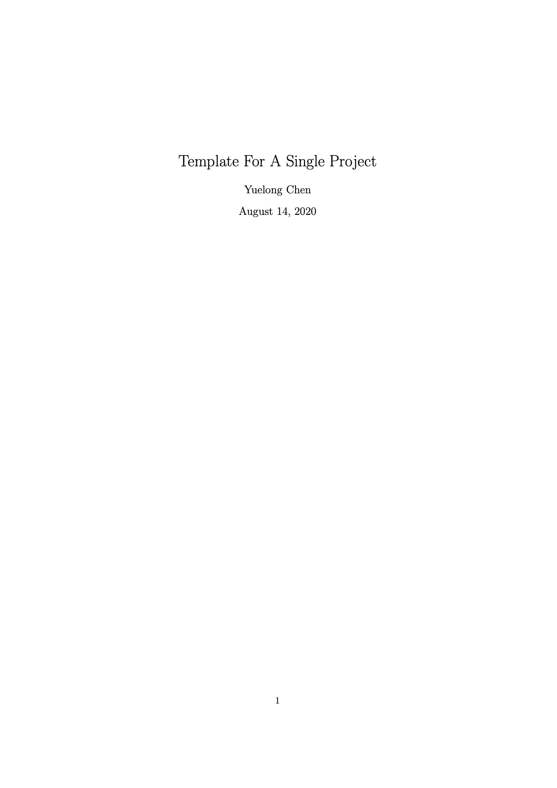
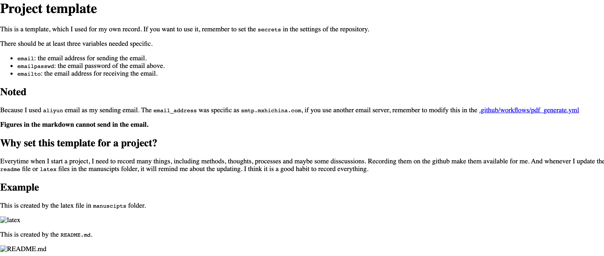

# Project template

This is a template, which I used for my own record. If you want to use it, remember to set the `secrets` in the settings of the repository.

There should be at least three variables needed specific.

- `email`: the email address for sending the email.
- `emailpasswd`: the email password of the email above.
- `emailto`: the email address for receiving the email.

## Noted

Because I used `aliyun` email as my sending email. The `email_address` was specific as `smtp.mxhichina.com`, if you use another email server, remember to modify this in the [.github/workflows/pdf_generate.yml](.github/workflows/pdf_generate.yml)

**Figures in the markdown cannot send in the email.**

## Why set this template for a project?

Everytime when I start a project, I need to record many things, including methods, thoughts, processes and maybe some disscussions. Recording them on the github make them available for me. And whenever I update the `readme` file or `latex` files in the manuscipts folder, it will remind me about the updating. I think it is a good habit to record everything. 

## Example

This is created by the latex file in `manuscipts` folder.

This is created by the `README.md`.

